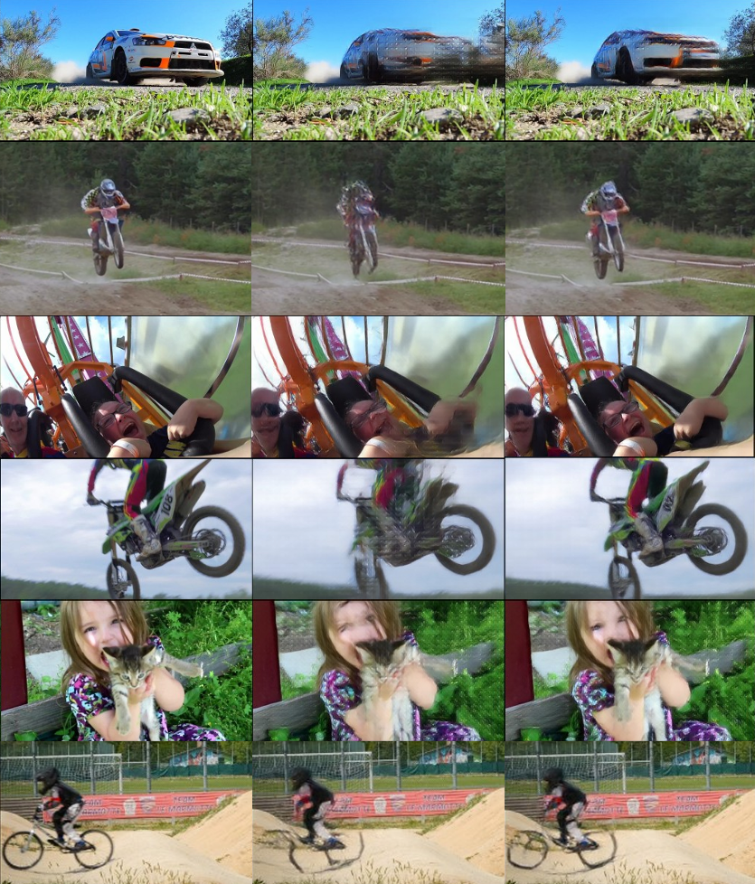
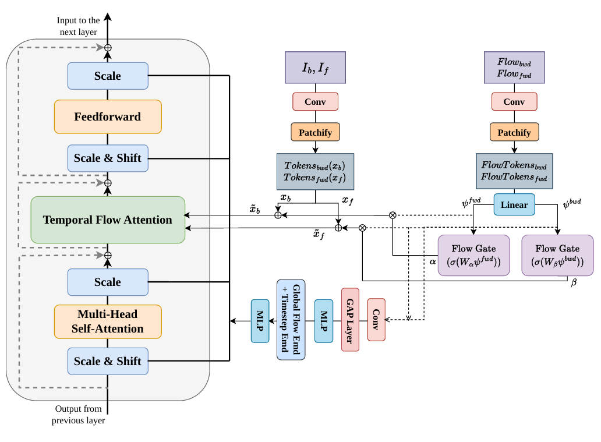

# EDENFlow: Flow-Guided Diffusion Transformer for Video Frame Interpolation

We introduce **EDENFlow**, a diffusion-based framework for high-quality video frame interpolation, designed for challenging scenes with large and complex motion.

Built on the EDEN architecture, our method integrates **optical flow guidance** into the diffusion transformer to improve motion understanding and temporal correspondence. We propose a **Flow-Guided Temporal Attention** module that uses forward and backward flow cues to guide feature aggregation during frame generation.

We further design a reduced-complexity lightweight variant that improves computational efficiency while maintaining strong interpolation quality, making the framework more practical for faster inference and resource-constrained settings.

Experiments show that EDENFlow produces sharper, more temporally consistent results and performs better in high-motion scenarios while remaining efficient.

<div>
    <h4 align="center">
        
    </h4>
</div>


## 🛠️ Pipeline
<div align="center">
  
</div><br/>

## :hammer: Quick Start

### Clone the Repository
```
git clone https://github.com/v34a11/EDENFlow.git
cd EDENFlow
```

### Prepare Environment
```
conda env create -f environment.yml
conda activate edenflow
```

### Prepare Datasets
Please download the datasets ([LAVIB](https://github.com/alexandrosstergiou/LAVIB?tab=readme-ov-file), [DAVIS](https://drive.google.com/file/d/1tcOoF5DkxJcX7_tGaKgv1B1pQnS7b-xL/view), [DAIN_HD](https://drive.google.com/file/d/1iHaLoR2g1-FLgr9MEv51NH_KQYMYz-FA/view), [SNU_FILM](https://myungsub.github.io/CAIN/)) and store them in the following format.
```
└──── <data directory>/
    ├──── LAVIB/
    |   ├──── annotations/
    |   |   ├──── train.csv/
    |   |   └──── ...
    |   ├──── segments/
    |   |   ├──── 10000_shot0_0_0_0/
    |   |   └──── ...
    |   └──── segments_downsampled/
    |       ├──── 10000_shot0_0_0_0/
    |       └──── ...
    ├──── DAVIS/
    |   ├──── bear/
    |   ├──── bike-packing/
    |   ├──── ...
    |   └──── walking/
    ├──── DAIN_HD/
    |   └──── 544p/
    |       ├──── Sintel_Alley2_1280x544_24_images/
    |       ├──── Sintel_Market5_1280x544_24_images/
    |       ├──── Sintel_Temple_1280x544_24_images/
    |       └──── Sintel_Temple2_1280x544_24_images/
    └──── SNU_FILM/
        ├──── test/
        |   ├──── GOPRO_test/
        |   └──── YouTube_test/
        ├──── test-easy.txt
        ├──── ...
        └──── test-medium.txt
```

### Download Checkpoints
EDEN baseline provide pre-trained model weights, available for download [here](https://huggingface.co/zhZ524/EDEN/tree/main) and recommend saving them in the `checkpoints` folder.

Our EDENFlow model checkpoint are that [here](https://github.com/v34a11/EDENFlow/releases/tag/v1.0) and recommend saving them in the `checkpoints` folder.


### Evaluation
To evaluate eden, running the following command(change the evaluation dataset in `congfigs/eval.yaml`): 
```
python eval.py
```

### Training
EDEN training consists of two stages: **eden_vae** and **eden_dit**. Use the following commands to train each stage:  

- **eden_vae**: `python train_vae.py`  
- **eden_dit**: `python train_dit.py`  

Training parameters can be adjusted in `configs/train_vae.yaml` and `configs/train_dit.yaml`. Logs are saved in the `output` folder.

## Acknowledgement
Our code is adapted from [EDEN](https://github.com/bbldCVer/EDEN.git), [GMFlow](https://github.com/lakonik/gmflow) and [RAFT](https://github.com/princeton-vl/RAFT.git). Thanks to the team for their impressive work!
